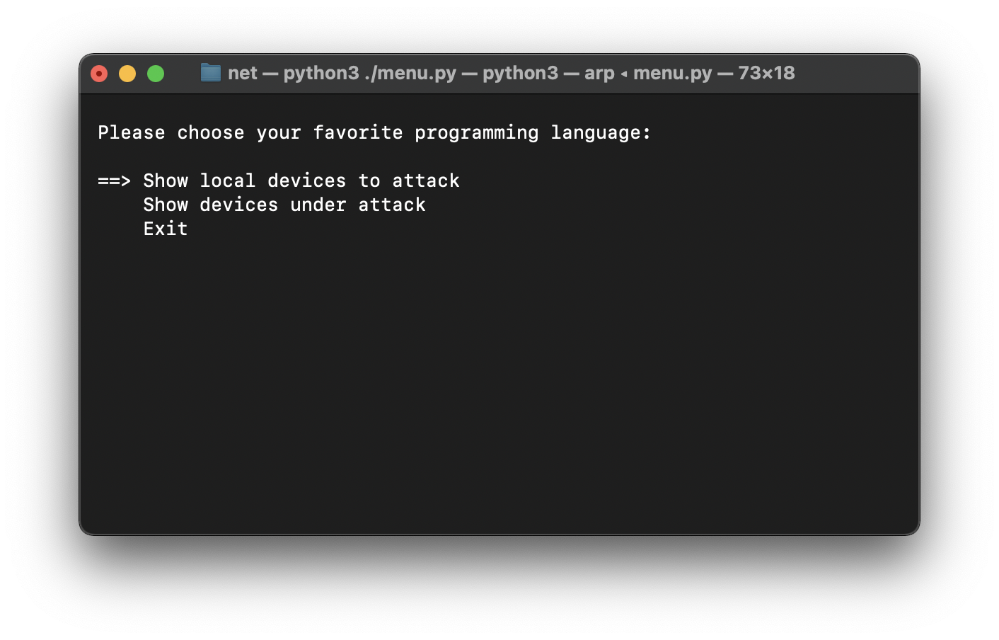
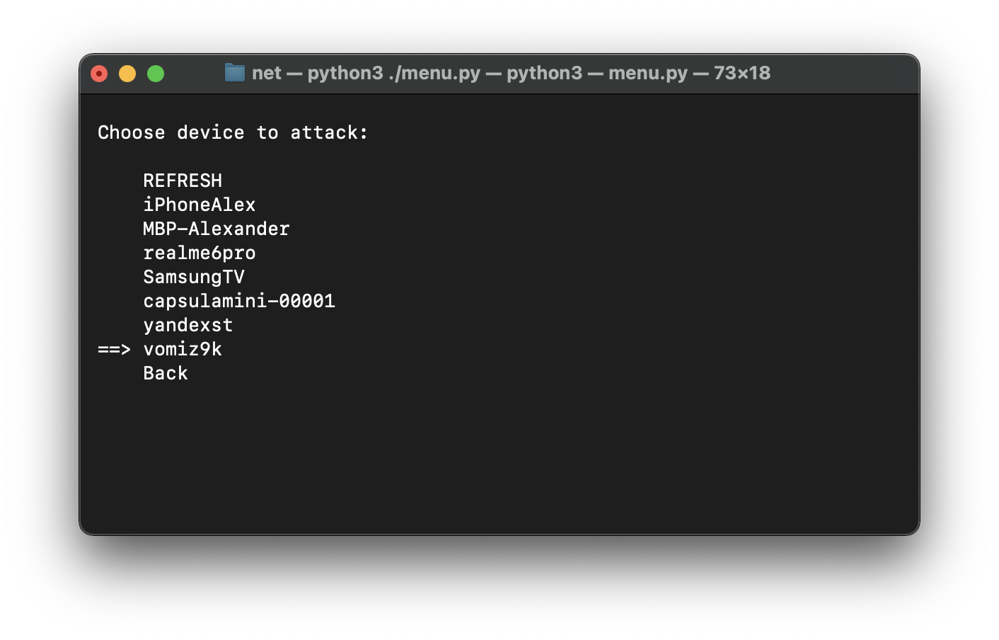
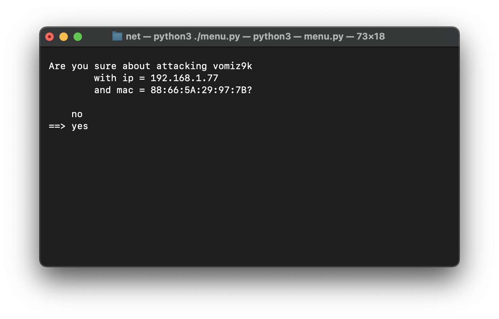
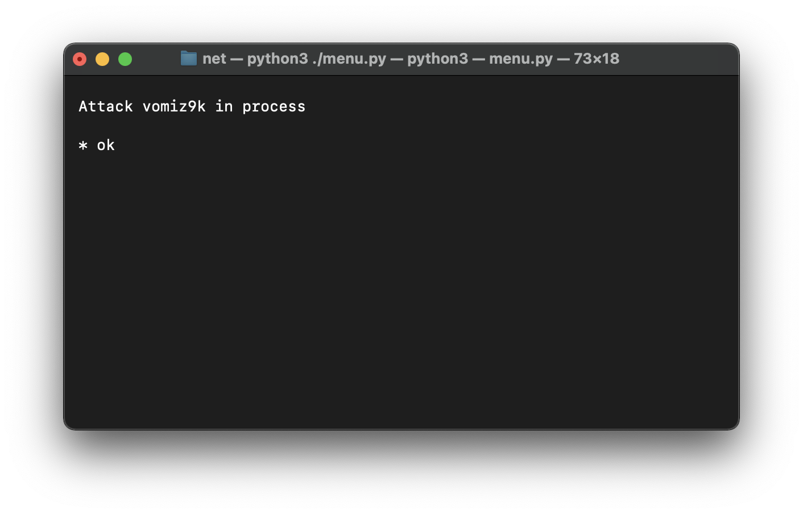
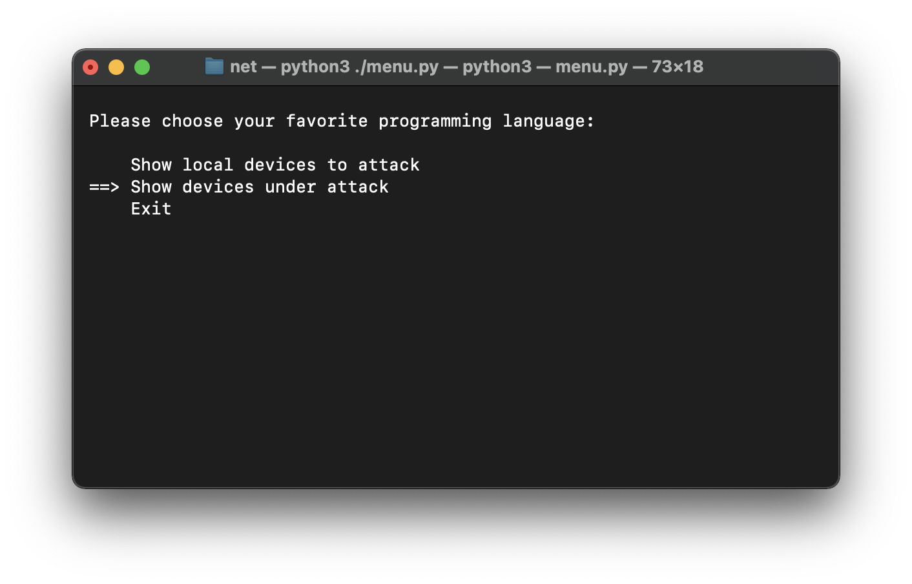
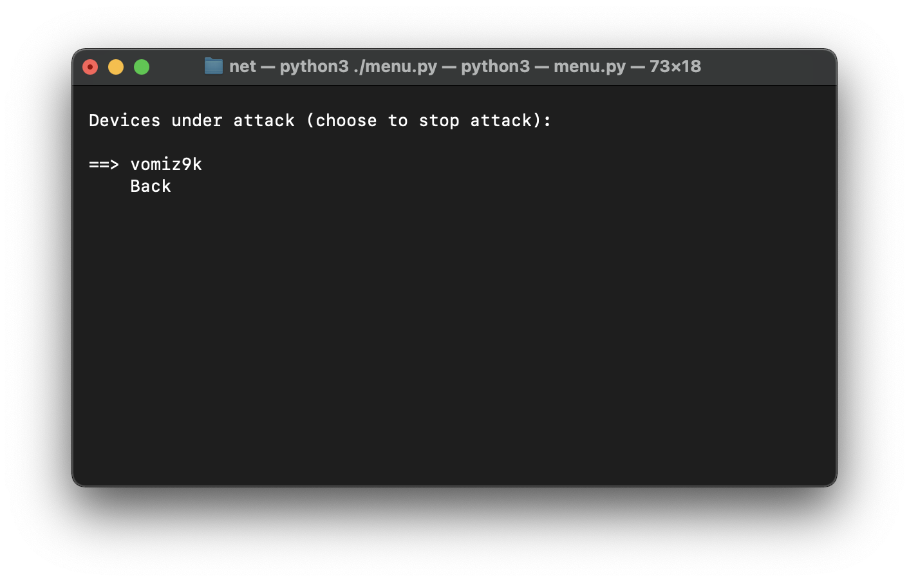

# net
 attack in local network tool

### Описание

Реализация отравления ARP в user-friendly интерфесе. В репозитории можно найти скрипты для сканирования локальной сети и основную программу для запуска: `python3 ./menu.py`.

В идеале ваш роутер должен поддерживать обратную зону dns, для представления списка устройств в читабельном виде.

Также можно использовать скрипт `arp_spoofing.py`, если вы заранее знаете ip и mac жертвы.

### Пример работы

Выбираем

Список устройств в локальной сети для атаки

Выбираем

Подтверждаем

Выбираем

Список утройств под атакой (каждая выполняется отдельно в своём потоке)

### Итог

Успешное испытание на соседях в общежитии... :-)
